从现在开始，使用Hexo+github搭载个人博客，编写自己的一些思路。


# 准备

window下环境：

- Node.js（使用各种js插件）

- Git（在window环境下，使用Linux命令并且上传github）

- github帐号配置

# 配置Node.js

下载Node.js安装文件

- [Windows Installer 32-bit](https://nodejs.org/dist/v4.2.3/node-v4.2.3-x86.msi)


- [Windows Installer 64-bit](https://nodejs.org/dist/v4.2.3/node-v4.2.3-x64.msi)

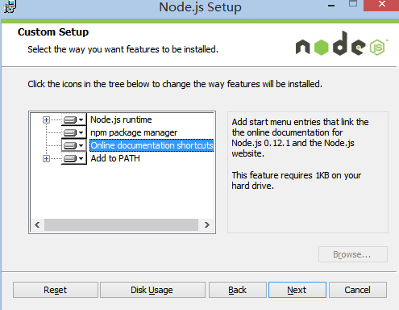

检查是否安装成功

```dos
node -v
npm -v
```

若出现下列，则为成功：

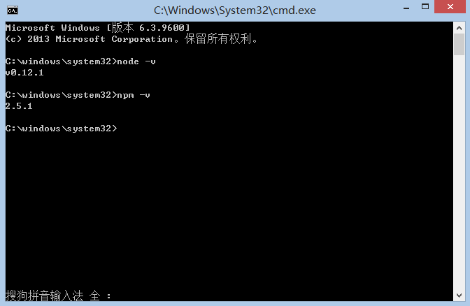

# 配置Git环境

下载安装：

- [Git-2.6.3-64-bit.exe](https://github.com/git-for-windows/git/releases/download/v2.6.3.windows.1/Git-2.6.3-64-bit.exe)

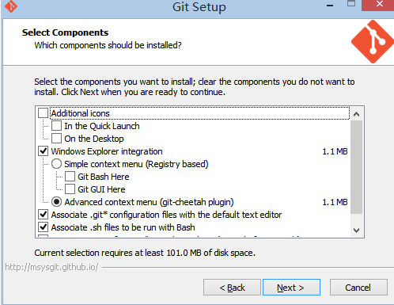

大部分保持默认设置，为了方便，建议PATH选项按下图选择（方便window右键出现git bash）

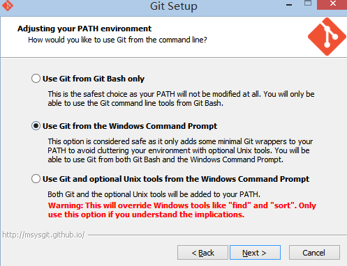

检查Git是不是安装正确了，打开命令，输入：

```
git --version
```

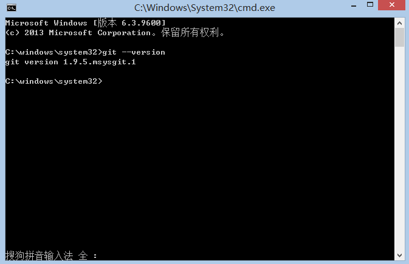

# 配置Github

1. 注册https://github.com，


2. 创建代码库New repository

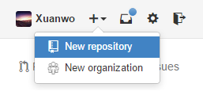

在Repository name下填写yourname.github.io，Description (optional)下填写一些简单的描述（不写也没有关系），如图所示：

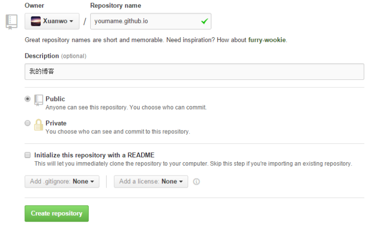

如下图：

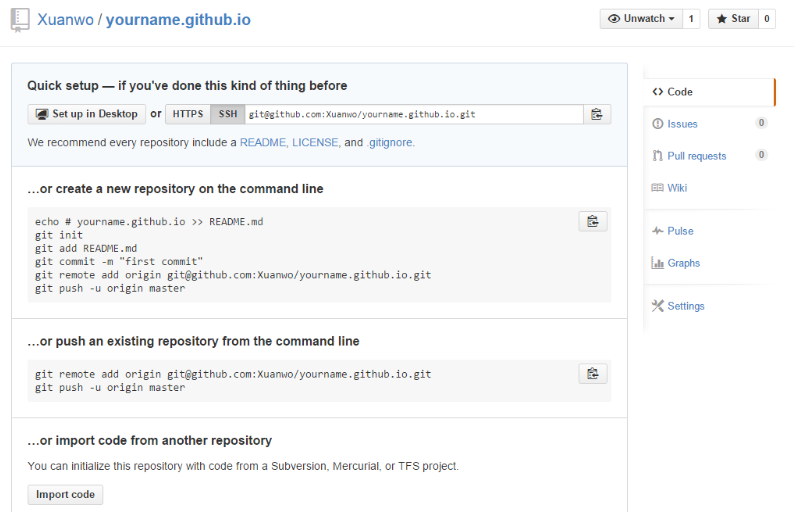

3. 开启gh-pages功能

   点即界面右侧的Settings,如下图：

   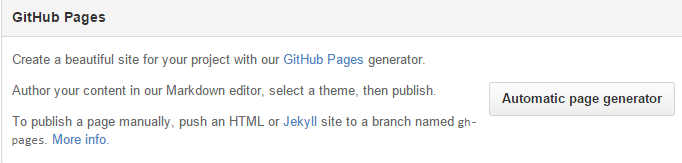

   点击`Automatic page generator`，Github将会自动替你创建出一个gh-pages的页面。 如果你的配置没有问题，那么大约15分钟之后，`yourname.github.io`这个网址就可以正常访问了~ 如果`yourname.github.io`已经可以正常访问了，那么Github一侧的配置已经全部结束了。

   配置Hexo

# 安装Hexo

   在自己认为合适的地方创建一个文件夹，然后在文件夹空白处按住`Shift`+鼠标右键，然后点击在此处打开命令行窗口。*（同样要记住啦，下文中会使用在当前目录打开命令行来代指上述的操作）*

   ```dos
   npm install hexo-cli -g
   ```

​       检测安装是否成功。

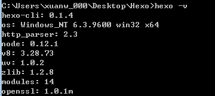

## 初始化Hexo

输入：

```dos
hexo init
```

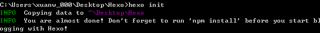

安装npm工具

```dos
npm install
```

构建Hexo

```
hexo g
```

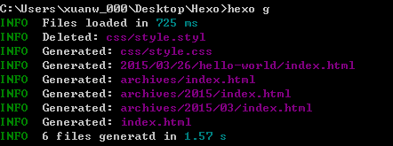

```
hexo s
```

出现以下提示：

```
INFO  Hexo is running at http://0.0.0.0:4000/. Press Ctrl+C to stop.
```

在浏览器中打开`http://localhost:4000/`，你将会看到：

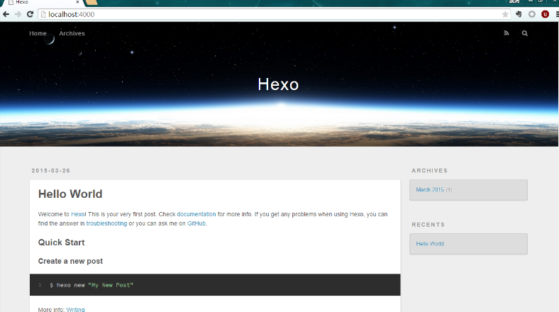

以上为基本的Hexo 在本地建立网站

# 配置github博客主页

上传配置github博客主页

初始化本地与远程github验证

```
git config --global user.name "yourname"
git config --global user.email "youremail"
```

在本机hexo/_config.yml文件中，找到`Deployment`，然后按照如下修改：

```
deploy:
  type: git
  repo: git@github.com:yourname/yourname.github.io.git
  branch: master
```

如果使用git方式进行部署，执行`npm install hexo-deployer-git --save`来安装所需的插件

在当前目录打开命令行，输入：

```
hexo d
```

随后按照提示，分别输入自己的Github账号用户名和密码，开始上传。 然后通过[http://yourname.github.io/来访问自己刚刚上传的网站。](http://yourname.github.io/%E6%9D%A5%E8%AE%BF%E9%97%AE%E8%87%AA%E5%B7%B1%E5%88%9A%E5%88%9A%E4%B8%8A%E4%BC%A0%E7%9A%84%E7%BD%91%E7%AB%99%E3%80%82)

添加新文章

打开Hexo目录下的`source`文件夹，所有的文章都会以md形式保存在`_post`文件夹中，只要在`_post`文件夹中新建md类型的文档，就能在执行`hexo g`的时候被渲染。 新建的文章头需要添加一些yml信息，如下所示：

```
---
title: hello-world   //在此处添加你的标题。
date: 2014-11-7 08:55:29   //在此处输入你编辑这篇文章的时间。
categories: Exercise   //在此处输入这篇文章的分类。
toc: true  //在此处设定是否开启目录，需要主题支持。
---
```

# 进阶

上面只是完成了基本的步骤，只是基本的博客。要使用个人定制，或别人的主题，需要用到下面的操作。

## 更换主题

*可以在此处寻找自己喜欢的主题* 下载所有的主题文件，保存到Hexo目录下的`themes`文件夹下。然后在`_config.yml`文件中修改：

```
# Extensions
## Plugins: http://hexo.io/plugins/
## Themes: http://hexo.io/themes/
theme: landscape //themes文件夹中对应文件夹的名称
```

然后先执行`hexo clean`，然后重新`hexo g`，并且`hexo d`，很快就能看到新主题的效果了~

## 更换域名

首先，需要注册一个域名。在中国的话，`.cn`全都需要进行备案，如果不想备案的话，请注册别的顶级域名，可以使用[godaddy](https://www.godaddy.com/)或[新网](http://www.xinnet.com/)或[万网](http://www.xinnet.com/)中的任意一家，自己权衡价格即可。 然后，我们需要配置一下域名解析。推荐使用DNSPod的服务，比较稳定，解析速度比较快。在域名注册商出修改NS服务器地址为：

```
f1g1ns1.dnspod.net
f1g1ns2.dnspod.net
```

## 添加模块

可以根据需求添加各种模块

```
// 流程图功能
npm install hexo-filter-flowchart --save

// Emoji
npm install hexo-filter-github-emojis --save

// 搜索功能
npm install hexo-generator-search --save

// 数学公式
npm install hexo-renderer-mathjax --save

// 添加图片显示，否则只能使用图床，针对github 博客
// 1.Make sure post_asset_folder: true in your _config.yml.
// 2.使用hexo new post_name ,会在_post文件夹新建post_name文件夹，存储图片
//安装错误，可能是node没更新
npm install hexo-asset-image --save

```


# 待续未完


## 参考资料：

[史上最详细的Hexo博客搭建图文教程](https://xuanwo.org/2015/03/26/hexo-intor/)

