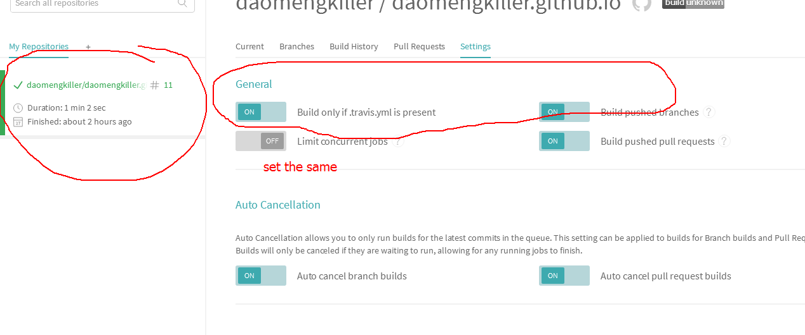
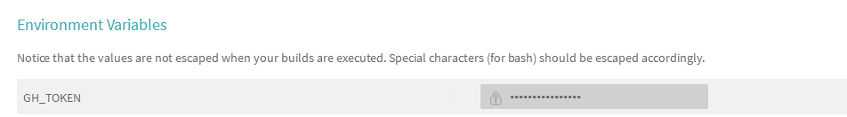

title: Travis CI 自动部署Hexo
date: 2018-04-09 11:05:58
tags: [Hexo,Travis_CI,github]
typora-root-url: Travis-CI-自动部署Hexo

本文主要介绍一下，如何将hexo博客自动集成在Travis-CI上，实现github pag 的自动更新

以后写文章自需要在hexo的根目录，source文件夹添加文章，自动在github网站更新。

<!--more-->

# 简介

> Travis CI 是在软件开发领域中的一个在线的，分布式的持续集成服务，用来构建及测试在GitHub托管的代码。

# 准备

Travis CI帐号

github pag 

思路：首先我的博客是使用Hexo来搭建的，托管到Github提供的Gitpage服务上的

每次写完博客git push到github，然后Travis自动构建，构建完成后自动推送到Gitpage服务上

生成后的HTML文件和博客的源文件我是放到一个仓库的，只是使用了不同的分支

master：博客的静态文件，也就是hexo生成后的HTML文件，因为要使用Gitpage服务，所以他规定的网页文件必须是在master分支

# Travis CI帐号

1. 注册，授权github

2. 设置环境变量，避免帐号密码泄漏

